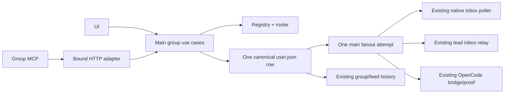

# Именованные групповые чаты: план реализации

Дата: 9 октября 2026. Статус: **план; реализация не начата**. **v2.1: тот же минимальный MVP, уточнённые контракты после повторного plan-improve.** R1–R3 проверяли прежнюю расширенную версию; отдельный audit упрощений указан в §17.

## 1. Результат и исходные условия

Добавить именованные группы внутри команды: создание из списка чатов, выбор минимум двух агентов, пользователь присутствует автоматически, независимое автоматическое включение новых участников, явная адресация сообщений и архивирование/восстановление. Агенты видят каталог групп со статусом и могут писать только в активные группы, участниками которых являются.

Подтверждено пользователем:

- минимум **2 выбранных агента + пользователь**; lead можно выбирать;
- все текущие агенты выбраны при первом открытии создания;
- «Автоматически добавлять новых участников» первоначально true, независимо от чекбоксов участников;
- picker переиспользует внешний вид Team: аватар, имя, provider/model/role, пассивные badges; ряд переключает checkbox вместо открытия профиля, нет кнопок задач/сообщений;
- архивные группы показываются ниже основных чатов с отступом и неактивным визуальным стилем; история открывается, чат можно восстановить;
- агенты видят архивный статус, писать в архив нельзя; автоматическое включение новых участников продолжает действовать;
- тесты только для необходимых рисков, без большой новой коллекции unit-тестов;
- исходный план прошёл **3 круга критики/исправлений на Hetzner, gpt-6.1-sol / xhigh**; новый запрос — убрать лишнюю сложность ради быстрого MVP;
- будущая реализация — hosted **MiMo-V2.6-Pro с thinking**. Эта задача не запускает implementation workers.

Основание:

- app: изучение и все три review inputs закреплены на **f7aaa7d0f31a1bc5ab0aebf53452b47b1f70e8a7**; в ходе завершения повторный fetch/checkout обновил отдельный worktree до свежего `origin/main` **e3fd06738cc0d4e4ce6bce5dacc3cee424b7c7ba**. Diff от review base — только README.md (8 additions / 6 deletions), source/runtime pin не изменились; обновлённый README прочитан;
- отдельный worktree: `/Users/belief/.codex/worktrees/group-chat-design/old-agent-teams-frontend`;
- pinned runtime: `runtime.lock.json`, v0.0.106 / **6118b106c29ea361e158ca15bb470d87419f0388**;
- исследованный runtime main: **265ea83827cff96929a9800432f70b1c8626d73a**; relevant SendMessage/inbox/poller/bridge совпадали с pin при исследовании. Перед implementation заново зафиксировать fresh exact SHA;
- грязные исходные checkout приложения и runtime не менять и не использовать для handoff;
- прочитаны mandatory common, проектные guardrails/feature standard; план применяет q: один владелец записи, минимальные реальные ports, общая presentation, без framework ради одной фичи.

## 2. Scope и жёсткие границы

### Обязательный MVP

Именованные группы: create/list/send/archive/restore, минимум 2 выбранных агента + implicit human, lead selectable, выбор участников и независимое auto-new=true. Reused Team presentation, постоянные ID/история, agent discovery и explicit reply/proactive destination. Все существующие chat surfaces открывают группу, draft/read state разделены по team/root/group. Native, lead и OpenCode используют existing transports с group-aware prompts/outcomes. Сервер запрещает запись в архив и неучастникам; UI архивные rows остаются читаемыми.

Архивирование относится только к новым именованным группам. Team-feed/DM сохраняют свои значения. Send — обычный текст, цитата, existing summary/taskRefs как metadata/display; отдельный group ask/do workflow не разрабатывается.

### Отложено, без скрытых обязательств

Изменение имени/состава/auto policy после создания, удаление истории, archive DM, attachments, slash/delegate, scheduling/approval и новый offline outbox, automatic task creation из group message, group pins/особый recent ordering, native desktop notifications групп, private ACL, cross-team groups, agent create/archive. Existing generic task tools остаются, отдельный group task/provenance UX и multi-agent command-id protocol не входят.

Нет нового store/БД, daemon, event bus, универсального receipt/recovery protocol, resumable group fanout после crash, гарантии exactly-once model execution, автоматического backfill/replay после restore или появления member. Group UI не запускает unsupported действия через DM callback. Для native notification scanner group rows просто исключаются; group local unread/read остаётся. История не смешивается с DM.

Название trim, 1–80 символов, plain text. Повтор имени допустим: идентичность UUID. В архиве запрещены новые сообщения также от пользователя; composer read-only + restore. Минимум 2 проверяется по configured eligible agents, не online count. Условие совместимых active runs для sends сохраняется в §9.

### Ограничения, зависимости и правило остановки scope

Единственная текущая specification — §2–13; исторические review findings не являются поручением вернуть v1. Изменять только group registry/use cases, два MCP tools, existing history/provider/runtime glue и общую conversation/Team presentation. Group tasks/pins/native notifications/offline queue/edit-membership не добавлять «заодно». Список рисков не означает отдельный сервис, DTO-layer или тест для каждого пункта.

Сначала readonly preflight точных app/runtime inputs и actual provider/tool wiring; затем изменения. Group UI send включается после compatible runtime/bridge readiness. Create/list/history/archive/restore не зависят от online state. Новый capability marker — поле existing run state, не новый capability service. Folder/source-size guards требуют extraction по ownership; новый reuse framework/DB/history engine запрещён.

Короткая application orchestration + реальные repo/roster/delivery ports достаточно. Existing main file locks, transport queues и history cursor переиспользуются; нет глобальной filesystem transaction. Если новое обязательство не относится к core или к доказанной регрессии от group metadata/routing, оно остаётся вне этой поставки.

### Как не превратить подробный план в лишнюю работу

Подробность §6–11 описывает поведение, а не обязательное количество компонентов. Начать с одного сквозного пути create → canonical send → existing provider delivery → group history, затем archive/restore и discovery; UI send до завершения group-aware runtime остаётся закрыт. Существующий owner, который уже обеспечивает нужный invariant, переиспользуется без второго wrapper/guard/ledger. Новая abstraction допустима только для реально разных ответственности/I/O boundary или подтверждённого DRY reuse; количество папок/классов не критерий готовности.

Для каждого нового guard указать конкретный failure в изменяемом owner и ближайший достаточный test/evidence из T1–T8. Несколько вариантов могут проверяться одним integration fixture; таблица edge cases не требует тест-файл на строку. Не добавлять отдельные unit-тесты DTO, forwarding, getters и каждой pure helper, если контракт уже проверен через authoritative boundary. Не проводить повторный полный pipeline на неизменном коде; после исправления запускать затронутые проверки, обязательные общие gates — на итоговом integrated SHA.

Разделы hosted/evidence и исторические findings не являются новыми implementation tasks. Если решение требует нового фонового процесса, нового persistent delivery state machine или изменения generic DM/task workflow, остановить расширение решения и сначала найти вариант в существующем owner. Доказанную group-routing/data-loss регрессию исправить узко; новая продуктовая возможность остаётся deferred. Оценка LOC в §15 — диапазон для планирования, не точное обещание и не повод искусственно добирать строки.

## 3. Архитектура сейчас и точки изменения

| Источник | Значение для реализации |
| --- | --- |
| `src/features/team-direct-chats/core/domain/conversationScope.ts`, `belongsToConversation.ts` | Сейчас team-feed/direct. Добавить group scope; DM явно исключает group rows. |
| `src/renderer/components/team/messages/MessageComposer.tsx`, `src/features/team-direct-chats/renderer/hooks/useTeamConversationSurface.ts` | Team-feed отправляет lead/fallback; positional send теряет channel. Floating принудительно выбирает feed. Нужен явный destination. |
| `src/shared/types/team.ts` | conversationId уже cross-team identity. Добавить отдельный groupChatId. |
| `src/main/ipc/teams.ts` | Native inbox, lead stdin/relay, OpenCode bridge — разные транспорты, не просто цикл DM callback. |
| `src/main/services/team/TeamSentMessagesStore.ts` | Ограничен 200 rows, непригоден как authoritative group history. |
| `mcp-server/src/tools/messageTools.ts` | message_send знает один адресат. Новые group_chat_list/group_chat_send. |
| `agent-teams-controller/src/internal/desktopControlBinding.js`, `internal/runtime.js` | Existing bound HTTP route; MCP/controller идут в тот же main use case. |
| `agent-teams-controller/src/internal/messageStore.js` | Unique canonical/physical IDs не должны создавать ambiguous store match; DM final-dedup helpers требуют group exclusions. |
| `TeamInboxReader.ts`, `TeamDataWorkerClient.ts`, `team-message-history/core/domain/messageSemantics.ts` | Whitelist metadata, revision/hash/equality; новые поля надо протянуть полностью. |
| `FileWatcher.ts`, `TeamTaskWatchRegistry.ts` | Зарегистрировать fixed registry filename и refresh UI/catalog. |
| `src/renderer/components/team/members/{MemberList,MemberCard,MemberQuickActions,CurrentTaskIndicator}.tsx` | Реальная Team presentation; undefined callbacks не убирают quick actions, task badge интерактивен. |
| `src/shared/types/notifications.ts`, `teamMessageNotificationScanner.ts` | В MVP group rows исключаются из native notification scanner; не открывать их как DM. |
| runtime `ordinaryMailboxMessage.ts`, `useInboxPoller.ts`, OpenCode reply/proof code | user inbound сейчас DM; mirror/outcome/fallback надо сделать group-aware. |

Названия отдельных renderer файлов уточнить rg в exact implementation worktree. Не привязывать план к старым line numbers после extraction.

## 4. Минимальные владельцы и DRY

Новая cross-process feature `src/features/team-group-chats/` владеет registry, membership/state policy и create/list/send/setArchived. `team-direct-chats` продолжает владеть conversation navigation/projection. Existing team/runtime services владеют provider delivery.

- contracts: DTO/API/channel constants без Electron/store/fs;
- core/domain: чистые policy/identity functions, без framework и без класса на каждую функцию;
- core/application: один небольшой application facade/use cases; ports только для repository, roster, canonical/delivery, которые реально пересекают boundary;
- main: atomic file repository, orchestration, existing transport adapter, composition и IPC/HTTP входы;
- preload: тонкий bridge, renderer получает feature API adapter;
- renderer: dialog/selectable presentation, состояние и API hook отдельно от domain.

Не создавать пустые directories/ports «на будущее», inheritance facades, service locator, whole-service host casts или event bus. HTTP и IPC вызывают **одного writer в main**, MCP не пишет registry/inboxes напрямую для group sends.

Общий `MemberRowPresentation` выделяется из Team MemberCard: avatar/fallback/ring/presence, имя, provider/model/role и пассивные status/task badges. Данные приходят готовыми presentation props, действия — slot оболочки. Team wrapper сохраняет свои profile/actions; picker wrapper содержит Radix Checkbox и row toggle. Не копировать Team styles/formatting и не импортировать весь MemberList с runtime timers/orchestration. `CurrentTaskIndicator` получает passive presentation или его визуальная часть извлекается; picker не содержит вложенной task button.

Frozen oversized MemberCard/MemberList/MessageComposer/teams.ts/FileWatcher/TeamMessageFeedService не растут сверх ratchet: meaningful extraction по ownership, а не механический перенос в misc файл.

## 5. Registry, membership и archive state

Один versioned `group-chats.json` в validated team directory, existing file lock + atomic write. Единственный writer — main feature. Нет user paths и нового registry service.

```ts
type GroupMembership =
  | { kind: 'fixed'; memberNames: string[] }
  | { kind: 'auto'; excludedMemberNames: string[] };
type GroupChat = {
  id: string; name: string; createdAt: string;
  membership: GroupMembership;
  archivedAt: string | null;
};
```

Eligible roster — existing reconciled config + team meta: configured agents, включая lead, без removedAt/temporary subagents. Offline остаётся в membership/minimum. Existing normalization имён, без новой identity system.

- fixed effective members = selected names ∩ current eligible roster;
- auto effective members = current eligible roster − явно unchecked при создании;
- Alice/Bob checked, Charlie unchecked, auto=true: David joins автоматически, Charlie остаётся excluded;
- вычислять effective members при list/send/UI refresh, также в архиве; не хранить вторую синхронизируемую membership copy;
- same-name remove/re-add сохраняет initial choice, rename считается новым member;
- effective <2: history/restore доступны, send blocked; новых участников не получает старая рассылка.

Create request: stable client UUID, name, selectedMemberNames, excludedMemberNames (явно unchecked в диалоге), autoIncludeNewMembers. Без expectedRosterRevision/creationFingerprint. Main проверяет формы/disjoint names, current selected membership и min2; новый незнакомый UI участник, появившийся пока диалог открыт, при auto=true включается, поскольку его явно не исключали. При auto=false только selected. Если выбранный member уже удалён — validation error + обновить список, не автоматически подменять выбор.

UUID генерируется один раз на попытку, поля disabled пока pending. Под registry lock existing ID возвращает исходную созданную запись и никогда не перезаписывает её; transport retry не создаёт второй чат. Если пользователь меняет draft после неопределённого ответа, сначала refresh результата попытки, затем новый UUID для нового намерения. Идентичность определяется первым успешным create, не повторным payload; UI использует actual returned record. Не вводить request hash/idempotency store.

Archive/restore: trusted human UI, groupId + desiredArchived boolean, same main owner/registry lock. Desired state idempotent; запросы сериализуются, последнее применённое состояние выигрывает. UI ждёт server response без optimistic перемещения и rollback-CAS. **Нет stateRevision/epoch и запрета ответа по старому inbound после restore**: восстановленный чат снова active; restore сам ничего не рассылает. После archive commit новые logical posts отвергаются (§6). Сохраняются ID/history/membership/draft/read. Restore при <2 разрешён, send blocked.

Missing registry = empty list. Corrupt/unreadable/unknown schema = explicit unavailable без overwrite. Loading не сбрасывает group selection, неизвестный ID не подменяется DM/feed.

## 6. Canonical identity и минимальная доставка

Canonical history сохраняется в existing `inboxes/user.json`, одна строка на logical post. Отдельные physical deliveries имеют unique ID и groupChatId/groupMessageId/groupChatProtocolVersion=1; не использовать cross-team conversationId. Canonical groupMessageId == messageId, physical groupMessageId != messageId. Frozen recipients и existing runKey сохраняются, sender-agent исключён из fanout; human видит canonical.



Send input: team/root context, groupChatId, stable messageId, text, summary?/taskRefs?, agent from + relayOfMessageId?; user identity задаёт trusted UI. Нет expectedStateRevision. Structured error/result сохраняется IPC→HTTP→MCP→runtime; archived/not-member/not-found/incompatible/storage/conflicting-ID/invalid-relay не вызывают private fallback. Не считать сохранение canonical доказательством ответа модели.

Порядок:

1. Main сериализует same logical ID и под strict source guard сначала lookup existing canonical. Тот же immutable destination/from/text/summary/taskRefs/relay возвращает saved record/status без dispatch, независимо от последующего archive/roster change; другой payload с тем же ID — conflict. Для new canonical короткий existing team-operation gate → registry lock → inbox lock. Проверить actual archivedAt, configured minimum, sender membership/current compatible recipient runs, optional relay. Archive пользуется тем же registry lock, поэтому у save/archive определён порядок. Locks не держать при transport/model await.
2. Под strict writer guard сохранить canonical и frozen recipient names/runKeys. Human canonical source=user_sent; agent canonical runtime_delivery semantics. Не дублировать canonical в sentMessages (200-row limit).
3. Один live main call создаёт physical deliveries через existing provider owners. Physical ID deterministic canonical + recipient hash; group metadata во всех adapters сохраняется. Current removal/run replacement проверяется перед physical commit/handoff через existing shouldStillWrite; old run не адресуется новому instance.
4. Независимые recipient attempts завершаются через all-settled с existing transport timeouts: ошибка одного не прекращает остальные. Вернуть результаты keyed by frozen recipient: queued/accepted/failed/unknown/skipped. Accepted требует proof exact physical ID, не общий count relayed messages в batch. После попытки **один раз попытаться сохранить** groupDeliverySummary `{recordedAt, recipients:[{memberName,physicalMessageId,status,reason?}]}` в canonical через тот же strict mutator. Physical ID детерминирован также для failed/skipped до append, поэтому snapshot однозначно keyed по frozen recipient + physicalMessageId. Queued означает persisted row без подтверждённого provider handoff; accepted означает exact-ID acceptance соответствующего existing transport (native — persisted inbox queue; lead/OpenCode — their actual proof), а не model reply. Возможный handoff без proof — unknown. Это snapshot результата, не receipt/claim/recovery state machine; потом не обновлять его фоновым трекером. Поле optional в persisted schema только из-за pending/crash/write failure. Missing summary = unknown, не failed/not-found. Mutable summary не часть immutable send comparison и runtime payload hash.

Result distinction: до canonical save admission/storage error сохраняет draft; после save ответ содержит saved=true + canonical ID + известные outcomes/statusPersisted. Failure записи summary не превращает сохранённый post в «send целиком failed» и не разрешает повторную рассылку. После app restart summary читается как last-known snapshot, без нового provider handoff; queued/accepted не означает model reply.

**Same-ID duplicate после canonical commit возвращает existing post и известный status, но НЕ запускает fanout повторно**, даже если исходная попытка partial/unknown. До canonical commit side effects не начинаются, definite failure до save безопасно повторить. Не достраивать непосланных recipients после app restart; не дополнять snapshot новыми members. UI не очищает draft при definite admission reject; при неопределённом IPC result повторить original send с тем же logical ID/immutable payload: same-ID serialization + lookup внутри существующего send API, без отдельного status endpoint. Отсутствие строки в независимом чтении не доказывает no-effect, пока original request может быть in flight; новый UUID автоматически запрещён. Новый post с новым ID только по явному действию пользователя; возможное повторение смысла показывается как tradeoff.

**Не создавать новый второй delivery owner.** Native — только inbox append + existing poller; group lead — inbox + TeamProvisioningLeadInboxRelayFlow, без одновременного direct stdin в group facade; OpenCode — existing inbox relay/bridge/proof. Existing relay serialization/dedup/recovery policy остаётся владельцем physical transport, но все group outcomes/fallback обязаны сохранять group identity. В `teams.ts` live lead direct-message branch содержит DM prompt; его нельзя вызывать как готовый group send. Shared adapter извлекает только нужную provider capability, не весь UI handler.

**Две обязательные узкие provider защиты, подтверждённые audit:**

- Lead `TeamProvisioningLeadInboxRelayFlow.ts`: existing no-deliveryConfirmed branch оставляет batch unread и повторяет через 10 секунд. Для group physical row перед sendMessageToRun атомарно поставить `groupHandoffStartedAt` под existing inbox lock с strict raw guard; только caller, первым поставивший marker, делает handoff. Повтор watcher/recovery не отправляет row с marker; existing proof может подтвердить доставку, отсутствие proof означает unknown. Claim write failure запрещает stdin. Group marker сохраняется всеми read/mark-read writers; mutable marker не часть runtime payload hash. Для batch mixed/group claim unclaimed group rows одним atomic update inbox, вернуть winning rows для конкретного caller; строить prompt только для них и eligible DM. Claimed group rows исключить из retry eligibility до расчёта batch/timer, чтобы не повторять их с новым DM и не крутить retry timer на unknown. Один claim caller владеет только returned physical IDs. **Returned batch — единственный input всего handoff:** prompt, originating scope, delivery proof, mark-read и fallback projection используют его же. Excluded/уже claimed group rows не участвуют ни в одном из этих действий; не сохранять original batch для downstream proof/read/projection. Empty returned batch — no stdin/no retry timer; claim write failure — no stdin. Ordinary DM branch остаётся. Crash между marker и stdin может потерять доставку: выбранный MVP не восстанавливает её автоматически.
- OpenCode `TeamProvisioningOpenCodeMemberInboxRelay.ts`: для group выключить requeue в `requeueOpenCodeRuntimeManifestWatermarkDeliveryIfNeeded` и `requeueOpenCodeNoAssistantTerminalDeliveryIfNeeded`; reuse existing ledger write-ahead/proof + read-commit recovery, без нового bridge call при ambiguous effect. В `opencode/delivery/OpenCodePromptDeliveryLedger.ts`, `shouldPruneOpenCodePromptDeliveryRecord`, group terminal record без inboxReadCommittedAt не pruning, иначе unread row запускает повтор после потери evidence. После confirmed read commit ordinary retention допустима. Не менять global DM recovery/retention. Tradeoff: часть unresolved terminal records сохраняется, uncertain handoff не replay.

Это конкретные guards existing owners, **не** универсальный per-recipient ledger/7-phase state machine. Native использует existing poller/read claims. Новой гарантии exactly-once model processing нет. Общий small completion summary отображает результаты, но не управляет dispatch. Provider-specific guards не разрешают повтор main fanout или досылку новых members.

**Archive barrier:** canonical committed до archive может завершить уже принятую physical доставку позже. После archive commit новые posts от user/agent запрещены; archive не recall транспорта. Relay validation: physical inbound действительно адресован sender и относится к указанной group. Actual current archived/membership authority всегда main. После restore валидный ответ на old inbound допускается; stale epoch fencing не является user requirement. Restore сам не replays inbox/черновики.

Roster atomicity ограничена existing app-managed gate; внешние config writers наблюдаются reconciled snapshot. Mutation после admission не отменяет принятый post, physical writer проверяет observed eligibility/run. Не добавлять distributed transaction со всеми filesystem writers.

## 7. История, projections и DM guards

UI показывает canonical rows, physical rows скрыты по groupMessageId !== messageId. Один source-level predicate применяется **до bounded top-K/history window**, после учёта raw position/revision; main и worker получают одинаковую семантику. Runtime inbox reader сохраняет physical rows для poller. Нельзя удалить их из inbox или отфильтровать только renderer: sparse continuation может получить hidden-only window/no_progress.

Canonical sort prefix при одинаковом timestamp полезен, но не обеспечивает pagination. На реальных source fixtures проверить raw/truncated frontier и continuation после canonical cursor, включая страницы, где raw rows почти все fanout. Existing team-message-history source/cursor остаётся владельцем; новую историю/курсор backend не вводить.

Group fields сохраняются через app/controller normalization, worker payload, hashes/revisions, OpenCode ledger/schema/payload hash, renderer merge/equality, task provenance. Physical ID используется для relay proof и unique exact lookup; physical row остаётся relay copy, не user original. Не разрабатывать group task_create_from_message workflow, automatic task mode или новый physical→canonical resolver. Существующий task boundary сохраняется; generic task tools не меняются. Metadata-only изменение archive через registry вызывает refresh независимо от наличия новых сообщений.

**Строгий source read–modify–write (R2):** group append, same-ID lookup и optional completion-summary mutation не используют permissive TeamInboxWriter.readInbox, который превращает non-array в [] и отбрасывает malformed rows. Под тем же existing file/inbox lock read bounded raw bytes → JSON parse → validate array/container → единый pure group-envelope validator → lookup/change только нужной строки → atomic write. Только ENOENT означает empty source. Parse error, non-array, duplicate canonical ID или повреждённая identifiable group row (есть любой group marker, но envelope/canonical identity невалидны) → GROUP_STORAGE_UNAVAILABLE, исходные байты неизменны, dispatch запрещён. Все unrelated raw entries сохраняются, не нормализовать/filter-and-rewrite историю. Этот общий guard вызывается и legacy writer, если source содержит group markers, чтобы соседний DM append не стёр повреждённую group row; обычные valid legacy DM semantics не перерабатываются.

Тот же pure validator из public group contracts применяется **перед** nullable history normalization и одинаково main/worker: malformed identifiable group row даёт source unavailable, не normalize=null/пустой чат. Отсутствие group markers сохраняет existing legacy read policy. Canonical без completion summary — known saved post с unknown delivery, не отсутствующий ID и не разрешение replay. No repair/overwrite «очищенным» JSON в этом scope.

Existing reader limit — **10 MiB на inbox source**, не обещание бесконечной истории. Любая group write (canonical append, completion-summary update, lead handoff marker) под соответствующим inbox lock проверяет точный serialized UTF-8 size; превышение existing limit → history-capacity error до записи, без truncate/empty overwrite. Use same existing constant, не второй magic number/reserve. Metadata update, не помещающаяся в source, сохраняет исходные байты: summary unavailable либо handoff claim failed, без truncate/rotation. Group history использует existing history owner с source selector inbox:user и group scope в cursor context: oversized physical-only sources не блокируют group canonical read. Aggregate feed сохраняет свою bounded availability; oversized/corrupt источник даёт явное unavailable с сохранением уже показанной истории, не empty group. Legacy writers всё ещё могут увеличить общий user inbox сверх лимита — inherited ограничение storage, фиксируется диагностикой; общая compaction/rotation всех team inboxes вне scope, не молча менять retention или повышать лимит.

DM predicate исключает все group rows. Team-feed остаётся агрегатом canonical сообщений, включая прошлую историю архивных групп. Archive не удаляет history/read state и не помечает её прочитанной автоматически.

Controller post-completion user-DM dedup исключает group rows **во всех helpers**, включая getPostCompletionFinalMessage, hasUserMessageSince, isReplyToHumanMessage. Иначе групповое сообщение может подавить настоящий DM или снять private guard. Group dedup scope содержит group ID. Existing isMeta/chunk/task/subagent semantics сохраняются, hidden hints используют wrapAgentBlock.

## 8. Как агент узнаёт группы и выбирает ответ

MCP full team profile: list/send регистрируются также в actual tool exports/profile/provider allowlists. Prompt с именем tool не доказывает его доступность; readiness marker публикуется после actual group-aware wiring. Не расширять другие tool permissions/profile capabilities.

- group_chat_list(teamName, from) → все group metadata: id/name/effective memberNames/archivedAt/canSend/reason;
- group_chat_send(teamName, from, groupChatId, messageId, text, summary?, taskRefs?, relayOfMessageId?) → saved canonical identity + delivery result или structured admission error.

Архивные группы видны, canSend=false. Metadata видна всей команде: private ACL не обещается. Agent неучастник писать не может, независимо от list. Новый history MCP не требуется.

**Discovery без дополнительного кеша/hash/revision:** read небольшой registry + current roster/run capability на каждый list. Existing member_briefing (launch/recovery после compaction) и group mailbox handoff prompt рядом с getOrdinaryInlineHandoffPrompt/useInboxPoller получают fresh catalog через bound feature API. Перед инициативной публикацией агент обязан вызвать list. UI watcher обновляет список по registry/config changes, но нет отдельной catalog-cache invalidation system, daemon, ack или wake всех агентов.

Group inbound несёт originating id/name/sender/canonical ID/physical ID и конкретный пример group_chat_send в эту группу. Group reply использует explicit originating ID + physical relayOfMessageId; proactive post возможен в любой своей active group после list. Peer FYI не требует обязательного ack. Sleeping/offline агент узнаёт изменения на следующем briefing/handoff/list, не мгновенно. Unavailable catalog не превращается в empty list/guessed destination.

Никакого lastGroupId. DM/несколько групп могут поступить одновременно. Native SendMessage остаётся DM/lifecycle; group_chat_send — группы. Plain text fallback допустим только при одном доказанном group inbound и через main admission; mixed/ambiguous outcome — diagnostic без guessed private projection. Agent sender validated roster/membership, cryptographic identity isolation не обещается.

## 9. Runtime и provider proof: обязательная совместимость

Один текстовый prompt из UI недостаточен: pinned ordinaryMailboxMessage/from:user трактует inbound как DM, mirror проецирует поля вручную, poller требует private reply, outcome/fallback распознаёт private message.

Обновить orchestrator group envelope/prompt/mirror/outcome/tool recognition. Успешный group_chat_send должен удовлетворять group reply outcome, без второго private ответа. relayOfMessageId связан с **physical** inbound, canonical group reply содержит эту корреляцию.

OpenCode: reply contract + ledger/hash + bridge visible proof + repair/fallback получают group identity/relay. Доказательство ответа требует правильной группы, sender и relay; proactive post в другую группу или private echo не доказывают reply. Archive/not-member/invalid-relay error — terminal blocked outcome, repair не делает resend/DM. Accepted prearchive inbound может закончить model turn; пока архивен admission запретит новый post.

**App-side lead fallback** тоже входит: TeamProvisioningLeadRelayProjection.ts и TeamProvisioningLeadInboxRelayFlow.ts сейчас independently пишут captured plain text в to:user/source:lead_process и sentMessages. Group success подавляет этот echo. Один однозначный group inbound + plain text → main group send с persisted physical relay и explicit group identity. Mixed DM+group/несколько групп, archived/invalid-relay/unknown outcome → diagnostic, no automatic private projection. Existing pure DM fallback сохраняется. Batch context явно хранит originating scope, не lastGroupId.

**Минимальный active-run proof:** новый runtime при bootstrap/ready публикует `groupChatProtocolVersion: 1` рядом с existing run/session/generation identity. Main bootstrap reader/run registry сохраняет `{memberName, runKey, protocolVersion}` только если runKey соответствует текущему живому процессу/bridge instance; OpenCode adapter публикует тот же proof после actual group-aware bridge readiness. runtimeVersion label/installed pin/bound HTTP наличие не proof. Stop/remove/restart/replacement/control loss инвалидируют запись. Domain порт возвращает opaque existing runKey; новую member identity system не вводить.

MVP policy: **offline/no-active-run участник входит в группу и минимум, но блокирует новый group send** с причиной recipient-unavailable. Create/history/archive/restore доступны; send требует совместимые current runs всех frozen recipients, без silent subset. Это осознанная граница: отдельная durable очередь «ждать будущий startup» не входит. Auto-added ещё не готовый участник тоже делает send unavailable до readiness; UI показывает кого надо запустить. Main повторяет proof/runKey check в physical writer shouldStillWrite и transport adapter перед handoff; смена run после acceptance → skipped, не доставлять новому instance старый fanout. Runtime mailbox consumption также проверяет group envelope runKey against its own run identity: старые physical rows не запускают новый run.

Release app pin указывает новый проверенный runtime. Уже работающие старые процессы не получают capability автоматически: требуется restart. Missing tools/control endpoint/proof → typed failure; no DM fallback. Сохранение DM/lifecycle возможностей не зависит от group capability.

## 10. UI: создание, архив и scope

Под основными chat rows находится «Создать чат» (shared Radix Dialog). Поле названия, selectable Team presentation, independent auto checkbox, Create с pending/validation. Нет отдельного «group/all selected» checkbox. Использовать shared Label, связанный htmlFor с единственным Radix Checkbox. Row label включает presentation; единственная mutation — onCheckedChange checkbox, без второго row onClick/onKeyDown и без nested buttons. Click row/avatar/checkbox и Space на focused checkbox toggles ровно один раз; Tab/focus-within подсвечивает строку. Enter не добавляет нестандартный checkbox handler. Passive badges не открывают задачи. Escape/cancel до Create submit ничего не создают; reopening запускает новый draft defaults. Закрытие диалога **после отправки Create RPC не отменяет server commit**: никакого cancellation protocol. Original pending request сохраняет UUID/payload независимо от нового dialog draft; registry refresh показывает созданный chat после success. Не переиспользовать UUID pending попытки для нового edited draft.

Список:

- обычные active chat rows, включая новые active groups;
- строка создания под active rows;
- ниже с заметным отступом отдельный «Архив» и архивные group rows, muted/disabled-looking, archive icon/label;
- archived row **остаётся click/keyboard selectable**, фактический disabled на row запрещён, иначе нельзя открыть историю;
- fixed active groups then archived groups, stable existing creation order; не добавлять group pin/recent ordering; existing DM pins не менять;
- в header active group action «Архивировать»; в archived header «Восстановить»; pending state виден, row перемещается только после confirmed response;
- если открытый chat архивируют, он остаётся selected, history доступна, composer disabled с причиной; restore сохраняет destination/draft;
- unread/read state сохраняется, archive не mark-read. Новых canonical messages в архиве нет; исторические badges могут сохраняться.

Group destination применяется на sidebar/expanded/fullscreen/inline/bottom-sheet/floating. `ConversationScope = group:{id}`; draft identity включает team/root + group ID. Request становится явным typed destination, без ещё одного boolean в positional onSend. Draft/pending reply/status не ключуются только memberName; новые group offline outbox/approval не входят. Reply author нужен для цитаты, не маршрутизации.

Archive сохраняет черновик; group draft не ставится в existing deferred/offline outbox. Если request успел принят до archive, canonical/status отображается в той же группе; если admission reject, текст остаётся draft, автоматического resend после restore нет. Metadata loading сохраняет selection; removed/unavailable group даёт понятное состояние, не переносит draft в DM/feed.

Canonical IDs — read/unread identity, group ID — destination. Одна группа не читает другую; feed читает aggregate по existing policy. Native desktop notifications для групп отложены: scanner group rows исключает, не направляет в DM. Sparse history/page budget показывают load-more, не ложную пустую историю.

## 11. Edge cases: поведение и достаточное evidence

Evidence IDs относятся к §12, не задают новый test на каждую строку. UI означает один synthetic CDP smoke; прочитанный источник — для unchanged existing policy.

| Ситуация | Обязательное поведение | Проверка |
| --- | --- | --- |
| Все checked/auto=false; Charlie unchecked/auto=true, David joins в архиве | Fixed не расширяется; auto включает David, Charlie excluded, archive read-only. | T1 + UI |
| Новый/removed member пока dialog открыт | Unseen auto member включается; removed selected требует validation/refresh. | T1 parameterization |
| effective <2 / offline / incompatible current run | History/restore доступны; send blocked, no subset. | T2 + UI reason |
| Create pending → close / reopen | Pending RPC не отменяется; old UUID не repayload, new draft независим. | UI; no cancellation suite |
| Same send ID / IPC timeout | Same payload возвращает existing; changed payload conflict. Retry original same-ID, no re-fanout/new UUID. | T3 |
| Один recipient failed / crash или summary write failed | Остальные attempt продолжаются; saved canonical сохраняется; partial/unknown visible, no resume. | T3 / existing writer error fixture |
| Lead watcher повтор после unknown; mixed batch | Claimed group не повторяется и не попадает в retry timer, новый DM не блокируется. | T7 |
| OpenCode uncertain terminal / read-commit recovery | No requeue/no evidence prune до committed read; observation/read recovery допустимы. | T8 |
| Archive racing send / restore + old reply | Registry order определяет save; archive rejects new posts. Restore ничего не replay; old valid reply разрешён. | T2 |
| DM + несколько groups / proactive в другой группе | Explicit originating group/relay; чужой proactive не reply proof; no private fallback. | T6 |
| Corrupt/non-array source / limit на metadata write | Byte preservation/unavailable/no handoff; missing final summary не повреждение row. | T4 |
| Fanout заполняет history window / equal timestamps | Pre-window filter + raw frontier progress, same main/worker. | T5 |
| Avatar/task badge click / archived selected group | One toggle/no profile/task; row readable, draft/selection сохранены. | UI |

## 12. Необходимые проверки без новой тестовой платформы

Тест добавляется только на наблюдаемую поломку, которую не ловят existing checks. Никаких unit tests на каждый DTO/helper/adapter, coverage quota, duplicated layer scenarios, snapshot suite или UI harness исключительно ради этого плана.

**До восьми focused scenarios**, reuse existing checks где уже ловят тот же риск. Parameterized variants не требуют отдельной suite для каждого слоя:

| ID | Наблюдаемая поломка, которую проверка должна поймать | Nearest owner |
| --- | --- | --- |
| T1 | Неправильный fixed/auto/excluded состав или min2, также в архиве | Group main use-case + temp registry/inbox fixtures |
| T2 | Archived/nonmember/incompatible send проходит или archive/save имеет неопределённый порядок | Тот же main integration fixture |
| T3 | Same-ID вызывает новый fanout; один failure прекращает остальных; saved post выдаётся за failed | Тот же main fixture, exact IDs/counts + writer error variant |
| T4 | Mutation стирает corrupt source либо metadata update пересекает existing size limit | Реальный temp fixture `src/main/services/team/__tests__/TeamInboxWriter.test.ts`, not mock-only substitute |
| T5 | Physical copies попадают в DM/history или hidden-only page теряет progress; corrupt history выглядит empty | Existing history/controller fixtures, shared main/worker reader boundary |
| T6 | Group reply/proactive отправляется не в ту group либо успешный/blocked outcome вызывает private echo | Existing runtime/provider outcome fixture variants |
| T7 | Lead watcher повторяет unknown physical ID или claimed группа захватывает новый DM batch | `TeamProvisioningLeadInboxRelayFlow.test.ts` |
| T8 | OpenCode uncertain outcome requeues либо terminal proof удаляется до read commit | Existing OpenCode relay/ledger tests |

Допускается один feature-owned integration test file в `test/features/team-group-chats/...` для нового facade с reuse temp helpers; запрет относится к новой универсальной test platform, не к осмысленному файлу. Domain membership покрыта T1 через authoritative boundary, не дублировать каждую pure function. `test/main/services/team/TeamInboxWriter.test.ts` использует fs mock: он не заменяет byte-preservation evidence реального temp source. Новых group task workflow tests нет; existing task rejection/provenance checks сохраняются.

Ориентир **350–550 changed test LOC** в app/controller/runtime, не обязательная квота. Два конкретных provider guards проверяются в тех же fixtures по их independent risk, не дублировать whole matrix. UI defaults/min2/lead/row toggle/archive/restore/draft и поверхности проверить одним synthetic CDP smoke, без обязательного нового component suite. Existing valuable tests не удалять.

Verification implementation: pnpm lint:fast:files по touched + pnpm typecheck; required full lint/architecture gates один раз на integrated exact SHA; affected suites; pnpm dev:mcp/CDP synthetic fixture, без Computer Use/native picker. Один test-only mixed-provider vertical smoke: text→group reply/proactive рядом с DM→archive→new member→restore→compaction catalog. Source cli-source для iteration; production built wrapper/pin proof перед shipping, без повторного полного pipeline на неизменном SHA. No real projects.

Команды используют pinned project toolchain. Focused app run — `pnpm exec vitest run <actual affected .test.ts paths>`; выбирать только затронутые owners. Проверенные source anchors: `src/main/services/team/provisioning/__tests__/TeamProvisioningLeadInboxRelayFlow.test.ts`, `src/main/services/team/provisioning/__tests__/TeamProvisioningOpenCodeMemberInboxRelay.test.ts`, `test/main/services/team/OpenCodePromptDeliveryLedger.test.ts`, `test/features/team-direct-chats/core/domain/belongsToConversation.test.ts`. Не запускать весь test catalog только потому, что пути перечислены; controller/runtime команды сверить по exact package manifest своего repo.

Observability — existing logger и structured outcomes: на failure groupId/logicalId/physicalId/member/provider/reason, без message text/secret/provider payload; per-message success debug flood не нужен. No new telemetry/event journal/metrics daemon. Пользователю достаточно group send reason, saved/partial/unknown outcome и existing load/error UI.

Сейчас проверяются документы/links/contracts, не implementation tests/live teams.

## 13. Порядок реализации и rollback

1. Fresh exact app/runtime inputs; contracts и main registry/create/archive/canonical send. Reuse existing owners, no new resumable ledger. One focused fixture group, UI send gated.
2. Controller/MCP, metadata/history/DM guards, runtime briefing/outcomes/provider group proof, current compatibility marker; update verified packaged runtime pin. One synthetic provider proof.
3. DRY Team presentation + group dialog/list/archive и общий conversation scope/draft/read во всех existing surfaces; один CDP smoke. Независимый exact-output code review + required integrated gates.

Вероятно 2–3 dependency-safe PR; не разделять envelope/runtime compatibility на unsafe промежуточную поставку. Shared oversized files имеют одного integration owner, extraction только по ownership. Порог review budget не повод для новой rollout platform.

Rollback disable create/send, сохранить registry/history и group-aware read/runtime. Старый binary без group guards нельзя просто поставить поверх persisted groups: DM leakage/private fallback. Binary revert требует compatible filtering/fail-closed patch. Не переписывать format/history и не replay partial/unknown. Никаких deletion operations.

## 14. Hosted handoff и модели

Существующий workstream `agent-teams-ai/hosted-web-v1`, host workers-fsn1-01. Проверены machine-id **d856d40da5ad4e23b4f67773e5942842**, scratch UUID **d0f2cac1-2009-4e9d-a710-e156f417938f**. Installed subscription-runtime release **5d57be691ac33f568e5653460636218aa9331e43**. Broker/schema берутся с этого release, никакого ручного registry editing. Новые jobs — serviceTier=default, отдельные workspace/home/leases, read-only critique, immutable plan SHA-256 + exact repo inputs, bounded output.

Три последовательных review rounds: critic **gpt-6.1-sol / xhigh**; затем исправление coordinator; следующему critic передаётся исправленный plan + previous findings/disposition. Это именно plan review, без code edits/build/runtime launches. Evidence записано в конце этого файла; raw results сохранены в durable artifacts существующего hosted workstream.

Будущие implementation workers: **MiMo-V2.6-Pro / thinking**, backend `xiaomi-mimo-token-plan`, model **mimo-v2.6-pro** (проверен в installed codex-model-backend.ts), reasoningEffort **high**. Runtime передаёт model_reasoning_effort; перед implementation стартом подтвердить accepted thinking configuration в actual session receipt, без подмены модели/effort при ошибке. Это не assertion, что upstream выполнил thinking до фактического запуска. Нейтральный root-only credential source уже разрешён владельцем: `/etc/subscription-runtime/secrets/shared/mimo-token-plan-api-key`; trusted launcher/project allowlist, ключ не читается/не копируется в repo/prompt/log.

Ownership будущих workers: main feature/registry/admission; controller/MCP/history metadata; runtime group outcome; renderer shared Team presentation/navigation. Подзадачи запускаются параллельно только после согласованного DTO и там, где файлы не пересекаются. Каждый worker предупреждён: другие работают в проекте, не откатывать чужие edits; own exact isolated worktree/export. Shared oversized files имеют одного integration owner. Автор реализации не review своего exact output.

## 15. Пересмотренная оценка объёма

Changed physical LOC = additions + deletions, без generated/lockfiles/binary/этого плана. Relocation existing UI считается дважды в diff; actual reporting выделяет relocation и net growth. LOC не formula completion и не test quota.

| Непересекающийся scope | Production LOC | Test LOC |
| --- | ---: | ---: |
| Renderer: DRY Team, create/list/archive, scopes/drafts/read/surfaces | 1 000–1 650 | CDP smoke; без нового UI suite |
| Main feature/registry/simple canonical fanout/IPC/HTTP/preload | 750–1 200 | 150–230 |
| Controller/MCP/history metadata + existing provider guards | 650–1 150 | 100–160 |
| Runtime group prompt/catalog/mirror/outcome/capability | 350–650 | 100–160 |
| **Рукописный код** | **2 750–4 650** | **350–550** |
| ~15–25 localization keys в 29 team locales | **450–700 data LOC** | — |

Новая рабочая оценка **~4 800 changed LOC**, диапазон **~3 550–5 900**, уверенность 6/10. Прежняя оценка ~6 300 относилась к расширенному protocol/scope. Ожидаемое сокращение diff ~25%, test budget ~вдвое; это не обещание такого же сокращения календарного времени. Strong runtime/history integration остаётся большей частью задачи. Точное число измеряется после implementation, не «гарантированные 4 800».

Экономия достигается сужением поведения, а не удалением no-data-loss/group routing/capability guards. Текущая source evidence не доказывает готовую interchangeable delivery abstraction: adapter реализуется через реальные existing provider owners, их различия не маскируются.

## 16. Acceptance и историческое review evidence

MVP готов, когда create defaults/min2/lead + DRY picker работают; fixed/auto состав правильный, также в архиве; архив readable/restore и server write block; list показывает agents groups/status/members/canSend; group reply/proactive route и DM separation верны; одна canonical history, no same-ID new fanout; partial/unknown честно отображается; strict writer не стирает данные; compatible current-run gate работает; focused tests и mixed-provider synthetic proof на exact integrated SHA прошли. Нет требования crash recovery, epoch-fence после restore, group task/notification/pin workflow.

### Историческое review v1: не является GO для изменённого v2

Все три critic jobs выполнены на **workers-fsn1-01, gpt-6.1-sol / xhigh**, serviceTier=default, read-only. Каждый следующий получил исправленный immutable plan и предыдущие findings. Actual launch model/effort проверены в worker process receipt; jobs завершены и отмечены reviewed через supported broker API. Это не три локальных self-review.

| Круг / job ID | Вердикт | Исправления |
| --- | --- | --- |
| R1 / `hosted-v1-group-chat-plan-20261009-r1` | REVISE, 9 findings | Историческая расширенная версия; новые выбранные границы и обязательные guards см. §2–13/17. |
| R2 / `hosted-v1-group-chat-plan-20261009-r2` | REVISE, 1 P1 | Strict raw source read–modify–write и общий envelope guard; сохранение исходных байтов и history unavailable вместо silent normalize-null. Повторно используется существующий temp fixture. |
| R3 / `hosted-v1-group-chat-plan-20261009-r3` | GO для v1 | Согласован исходный расширенный контракт; это не evidence для нового delivery contract v2. |

SHA-256 immutable входов и raw result artifacts:

- R1 input: `07893ca98885c94355da39c5e5d0b995648d47d98c621043e3d3cf77b235507e`; result: `1165d743b0afe35e6e0b962e7b60157d432c6f9d3993ee183373e2db8f98d536`.
- R2 input: `fb1b5571c5b67f80345a88d118d14a033af8be9b1d1b35051f67315c9d7deea2`; result: `b1424d599def191a323838e13df23172e93c3b04642cf052ec4f8686f614f595`.
- R3 input: `bb6fdbcd0c8c247b74fee92226052fa6f2fa3b2348a41ea6ffd791e4e5a52d31`; result: `6f111971d3c929b061689b9c7a2595d2b3135645060c05b9a66c849efbb3df1d`.

Для каждого job raw result расположен на hosted host: `/srv/worker-state/jobs/agent-teams-ai/hosted-web-v1/jobs/<jobId>/<jobId>.latest-result.json`. После каждого результата operator отдельно проверил HEAD **f7aaa7d0f31a1bc5ab0aebf53452b47b1f70e8a7** и clean workspace вне provider sandbox; сам critic не имел доступа к linked git-common-dir. R3 result завершён 2026-10-09T13:26:23.971Z, executionGeneration `43be5022-e079-49a4-870c-1cdd4febf31c`, attempt 1. Runtime часть review опирается на pin/excerpts и исследование coordinator; это не live proof нового runtime. Полный fresh runtime exact SHA и operational proof обязательны при реализации.

После R2 перед R3 дополнительно устранена двусмысленность: отсутствие physical row после crash/pruning не доказывает отсутствия handoff; damaged receipts — storage-unavailable, valid uncertain outcome — unknown. После исходного GO пользователь запросил новый scope audit; v2 отменяет часть stronger guarantees (см. §17), поэтому GO R3 нельзя переносить на новый delivery contract. Реализация, builds, feature tests и team/runtime smoke не запускались. **GO относится к готовности плана, а не к готовности фичи; implementation workers MiMo ещё не запущены.**
## 17. Что упрощено и какие компромиссы приняты

| Убрано из v1 | Чем заменено | Сохраняемый core / tradeoff |
| --- | --- | --- |
| 7-phase per-recipient durable receipts, resumable fanout/recovery | One canonical → one live fanout attempt; existing provider owners/proof | No same-ID new fanout; partial crash не досылается автоматически. |
| stateRevision/CAS/old-relay epoch fence | Actual archivedAt under admission lock, desired bool + confirmed UI | В архив write blocked; после restore old reply допустим, restore ничего не replay. |
| expectedRosterRevision + creationFingerprint | Stable UUID + current selected validation + explicit unchecked set | Create transport retry returns first record; unseen new auto member включается. |
| Catalog hash/cache/invalidation subsystem | Fresh on-demand list в actual briefing/handoff | Agents discover current groups, main each-send authority. |
| Group task modes, pins/recent ordering, native notifications/new outbox | Basic text/reply/scope/draft/read + disabled unsupported actions | Не сокращает заявленное создание/общение/архив; дополнительные workflows отложены. |
| Большая matrix/unit/UI suite | 6–8 strong cases в existing fixtures + один CDP smoke | Risk coverage на nearest authoritative boundary, no helper coverage quota. |

**Оставлено обязательно:** main authority/archive/membership, one canonical/unique physical identity, correct native/lead/OpenCode destination/outcome + no private fallback, current run compatibility, atomic/strict byte-preserving storage, pre-window history filtering/main-worker parity, DRY selectable Team presentation. Их удаление сэкономило бы строки ценой поломки основных требований.

Independent simplification audit завершён: hosted `hosted-v1-group-chat-simplify-20261009-r1`, **gpt-6.1-sol / medium**, read-only. Вердикт **REVISE: упрощения принять, добавить две узкие provider защиты**. Обе внесены в §6 и nearest fixture §12; archive/create/discovery/scope cuts критик поддержал. Input был immutable v1 + конкретное предложение v2, не готовая implementation. Полный protocol/recovery не возвращён.

Input SHA-256 `ff946dd2a41b82eb5b2c323cc0ddc1941f2b83a8921df065b0a4e96e9167867d`; result SHA-256 `6cd25095d2db32546cdb333d42cedf5cb9b32106b822f0d3e65ea2f16b8f49ef`. Raw result `/srv/worker-state/jobs/agent-teams-ai/hosted-web-v1/jobs/hosted-v1-group-chat-simplify-20261009-r1/hosted-v1-group-chat-simplify-20261009-r1.latest-result.json`, completed 2026-10-09T13:46:11.345Z. Operator exact source HEAD f7aaa7d0f31a1bc5ab0aebf53452b47b1f70e8a7, clean; provider самостоятельно git-common-dir не проверял. Исследованы app delivery owners, runtime по pinned excerpt. Реализация и feature tests не запускались.

**Текущая specification — v2 (§2–13); исторические R1–R3 findings не расширяют её scope.** Основной компромисс — no resumable fanout после crash, старый reply после restore допустим. Deferred group tasks/pins/native-notifications не следует «заодно» добавлять при implementation. При обнаружении нового concrete failure сначала минимальный guard в actual owner, не возвращать весь v1 protocol.

Повторный plan-improve v2.1: уточнены definite/unknown send outcome, один final delivery snapshot без recovery, all-settled fanout, idempotent RPC retry без нового endpoint, pending dialog close semantics, actual MCP/profile discoverability, bounded metadata writes и evidence T1–T8. Scope/LOC budget не расширены. Independent targeted audit завершён: `hosted-v1-group-chat-plan-improve-20261009-r1`, **gpt-6.1-sol / medium**, read-only. Вердикт REVISE с двумя уточнениями: returned lead batch одинаков во всех proof/read/fallback consumers; final summary keyed конкретным physicalMessageId. Оба внесены в §6; новой функции/сервиса/test suite не добавлено. Input SHA-256 `01345db25bc2d5cd459b48c5dad95425b041a4b8ac8bd48111c4d6ffb9afaa71`; result SHA-256 `2fe7d372a7c2902a4b771e8a06e3c465916d1d86b4469a143c92f75c8b5700bf`, completed 2026-10-09T14:16:53.195Z, executionGeneration `47934e91-ef90-4f83-abfa-2e90c7b374cc`, attempt 1. Raw result — durable hosted job directory с тем же job ID. Operator проверил source HEAD f7aaa7d0f31a1bc5ab0aebf53452b47b1f70e8a7 и clean workspace. Review specification-only; полный runtime в этом дополнительном проходе не изучался. R3 GO остаётся историческим для v1; реализации/feature tests нет.
